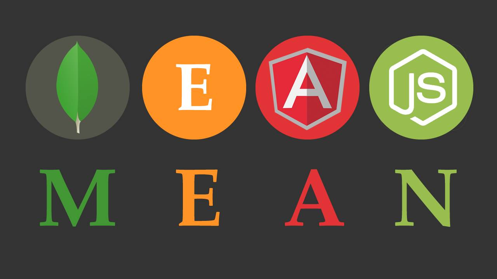

<h1>E-Wallet / Web-Wallet Application on MEAN Stack</h1>

   
<h2>Node Server on PORT 3000</h2>
   
<h2>Angular Live Deployment Server on PORT 4200</h2>
   
<h2>MongoDb DB name meanapp (user schema in models/users.js)</h2>
   

  "dependencies":{
  
  	"express":"*",
    
  	"mongoose":"*",
    
  	"bcryptjs":"*",
    
  	"cors":"*",
    
  	"jsonwebtoken":"*",
    
  	"body-parser":"*",
    
  	"passport":"*",
    
  	"passport-jwt":"*"
    
  },
  
  "author": "sudopower",
  
  "license": "ISC"
  
}

